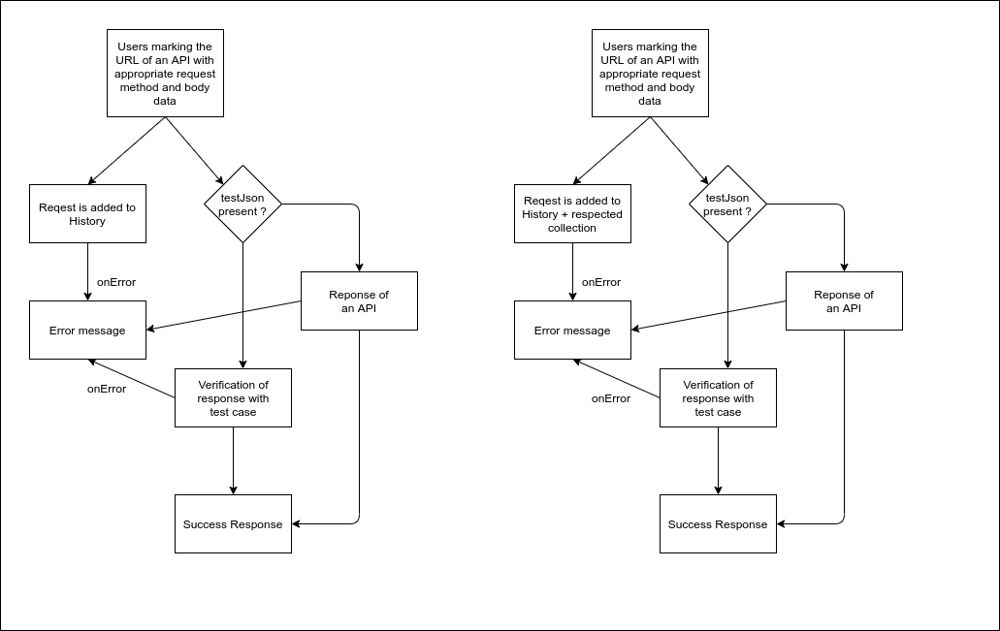
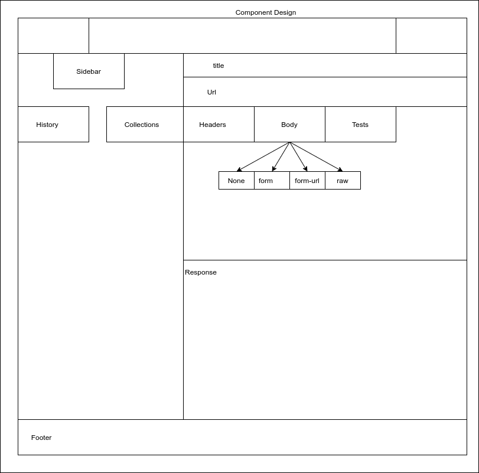
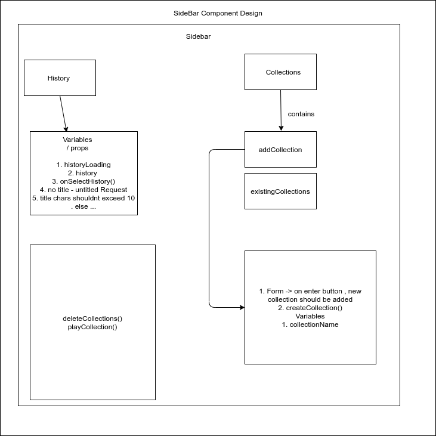
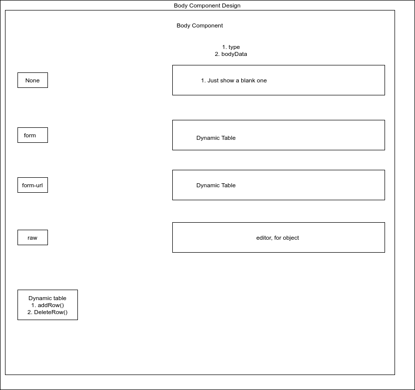
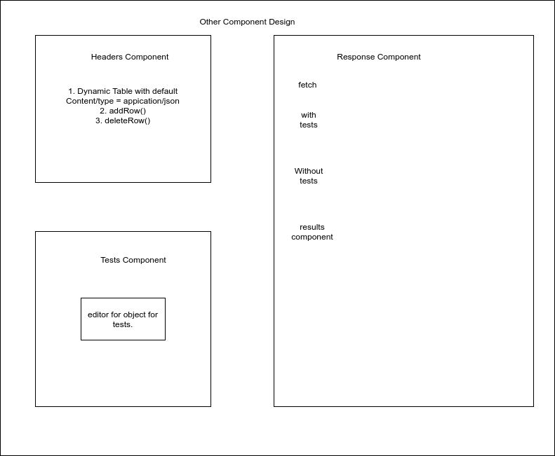

# MyPOSTMAN 🚀

## Scope

Postman right now focuses on the following functionalities.
- Returns an response to an API made by you or others.
- Provision to add expected result of an API.
- Validates API response with expected case and provides you the result.
- API is saved in history for future use.
- One or more API requests can be added into a collection for easy categorisation.
- Play collection to verify the API's are working as expected.
- In future, 
    - timely alert for testing of API's.
    - Sharing the response to peer developer.
    - UI advancements
    are possible.

## User journey flow 🚗

created in https://app.diagrams.net/

## Technical Stack 🧰 

### FrontEnd 

- React 16
- Ant Design 4.66
- State management library used : None
MyPOSTMAN functionality scope is limited right now and we might use Redux in future.
- CSS - Styles file specified in the respective folder for better readability.

### Backend

- NodeJS
- ExpressJS
- MongoDB

### Authorization

- Login screen is displayed at prior of application screen.
- User is autorised at the login.
- For every subsequent request, user credentials in the form of JWT is sent along with requests.

### Component Design 

- Overall Components 
    

- Sidebar Component Design
     

- Body Component Design 
    

- Response and other Components Design
    
